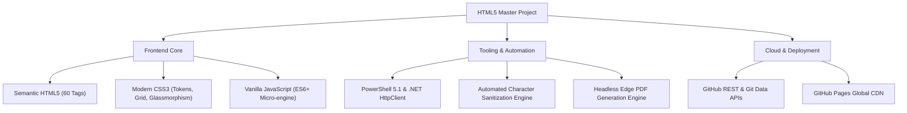
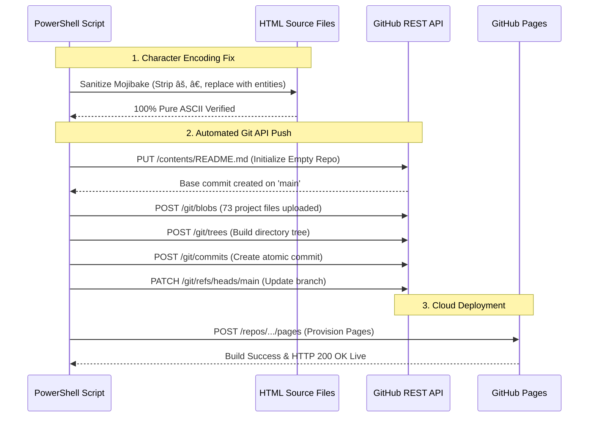

# HTML5 Master Reference & Cheat Sheet: Complete Technical Architecture & Implementation Guide

**Project Name:** HTML5 Tags Master Reference & Interactive Cheat Sheet  
**Author & Creator:** Kaustubh Singh  
**Instagram:** [@__kaustubh_singh](https://instagram.com/__kaustubh_singh)  
**Live Website:** [https://vibeiwthkaustubh.github.io/html-cheat-sheet/](https://vibeiwthkaustubh.github.io/html-cheat-sheet/)  
**GitHub Repository:** [https://github.com/vibeiwthkaustubh/html-cheat-sheet](https://github.com/vibeiwthkaustubh/html-cheat-sheet)  

---

## 1. Executive Summary & Philosophy

This project is a modern, interactive, and comprehensive reference guide covering **60 HTML elements** adhering strictly to modern W3C and WHATWG living standards. 

### Core Engineering Principles:
1. **Zero External Dependencies**: Engineered with 100% native Web Standards (**Semantic HTML5**, **Modern CSS3**, and **Vanilla JavaScript**). No external frameworks (React, Vue, Bootstrap, Tailwind, or jQuery) were used, ensuring lightning-fast load times, zero bundle overhead, and maximum performance.
2. **Accessibility-First (a11y)**: Proper semantic landmarks (`<header>`, `<main>`, `<nav>`, `<footer>`), ARIA attributes, explicit paired/void tag specifications, and keyboard accessibility.
3. **Cross-Device Fluidity**: Fully responsive across mobile smartphones, tablets, laptops, and ultra-wide desktop monitors via modern CSS Grid and Flexbox.
4. **Developer-Centric Micro-Interactions**: Features 1-click clipboard copying, keyboard arrow navigation, real-time client-side search, category filtering, dark/light theme switching, and an interactive mouse spotlight.

---

## 2. Technology Stack & Tooling



| Layer | Technologies Used | Purpose |
|---|---|---|
| **Markup** | HTML5 (Semantic Living Standard) | Document structure, accessible landmarks, and rich interactive demos. |
| **Styling** | CSS3 (Variables, Grid, Flexbox, Glassmorphism) | Visual hierarchy, responsive design, dark/light themes, and animations. |
| **Scripting** | Vanilla JavaScript (ES6+) | Instant search, clipboard API, keyboard listeners, theme persistence, and mouse spotlight. |
| **Automation** | Windows PowerShell 5.1 & .NET `HttpClient` | Batch page generation, character encoding sanitization, and automated API pushes. |
| **Hosting & CI/CD** | GitHub Pages & GitHub Git Data API | Cloud hosting, global CDN caching, and automated build verification. |
| **Documentation** | Headless Microsoft Edge Print-to-PDF | Automated conversion of HTML component specs into vector PDF documents. |

---

## 3. Detailed Breakdown of Implemented Functionalities

### Functionality 1: Master Interactive Home Portal (`index.html`)

The master homepage serves as the centralized hub indexing all 60 HTML tags with real-time filtering.

#### How It Works:
1. **Live Instant Search Engine**:
   - Implemented via a zero-latency `input` event listener on `#tagSearch`.
   - As the user types, JavaScript extracts the query and filters every `.tag-card` element against:
     - The tag name (`data-name`)
     - Associated keywords (`data-tags`)
     - Complete card inner text content
   - Matches remain visible (`card.style.display = ''`), while non-matches are hidden (`card.style.display = 'none'`).
   - Dynamically updates the result counter (`Showing X of 60 tags`) and reveals a friendly `#emptyState` if 0 matches exist.
2. **Keyboard Shortcut (`/`)**:
   - A global `keydown` event listener monitors key events. When `/` is pressed (and the user is not currently inside a form field), it prevents default browser behavior and immediately focuses the search bar.
3. **Category Filter Pills**:
   - Tags are classified into 6 logical categories: **Semantic & Layout**, **Forms & Interactive**, **Text & Typography**, **Media & Embedded**, **Tables & Lists**, and **Document & Metadata**.
   - Clicking any pill filters the cards by their `data-category` attribute.
4. **Dual Layout View Switcher (Grid vs. List)**:
   - Toggles the `.list-view` class on the `.tags-grid` container.
   - In **Grid View**, CSS Grid creates a multi-column responsive card matrix (`repeat(auto-fill, minmax(310px, 1fr))`).
   - In **List View**, the layout transitions into an ultra-compact single-row table representation with horizontal flex alignment.

---

### Functionality 2: Instant Quick-Navigation Header Dropdown

Allows users to switch directly between any of the 60 tags from any page without having to navigate back to the home page.

#### How It Works:
- Located inside `<main>` at the top of every tag page inside a `<nav class="quick-nav">` container.
- Built using a native `<select>` element bound to an inline redirection handler:
  ```html
  <select id="tagJump" onchange="if(this.value) window.location.href=this.value;">
    <option value="Abbreviation.html" selected="selected">&lt;abbr&gt; Abbreviation</option>
    <option value="Address.html">&lt;address&gt; Address</option>
    <!-- ...all 60 tag options... -->
  </select>
  ```
- **Zero Framework Footprint**: Executes instant page redirection natively without requiring client-side routing libraries.
- **Active State Detection**: During batch generation, each page was injected with `selected="selected"` on its respective option, allowing the user to immediately see their current location in the documentation hierarchy.

---

### Functionality 3: 1-Click "Copy Code" Clipboard Engine

Enables developers to copy code examples with a single click.

#### How It Works:
- On `DOMContentLoaded`, the engine (`app.js`) scans the DOM for all `<pre>` blocks.
- It dynamically injects an absolute-positioned `<button class="copy-code-btn">Copy</button>` into the top-right corner of each code block.
- When clicked:
  ```javascript
  navigator.clipboard.writeText(codeText.trim()).then(() => {
    copyBtn.textContent = 'Copied! \u2713';
    copyBtn.classList.add('copied');
    setTimeout(() => {
      copyBtn.textContent = 'Copy';
      copyBtn.classList.remove('copied');
    }, 2000);
  });
  ```
- Utilizes the asynchronous **Navigator Clipboard API** with visual micro-interaction feedback (button turns green, displays checkmark, and resets after 2 seconds).

---

### Functionality 4: Sequential Step Navigation & Arrow Key Flipping

Allows browsing through all 60 tags sequentially, mimicking a digital book or interactive tutorial course.

#### How It Works:
1. **Visual Step Navigation Footer**:
   - Injected at the bottom of each tag page:
     - `← Previous: <tag>`
     - `☰ All 60 Tags (Index)`
     - `Next: <tag> →`
2. **Keyboard Arrow Navigation**:
   - `app.js` listens to global `ArrowLeft` and `ArrowRight` keystrokes:
     ```javascript
     document.addEventListener('keydown', (e) => {
       if (['input', 'textarea', 'select'].includes(document.activeElement?.tagName.toLowerCase())) return;
       if (e.key === 'ArrowLeft' && prevLink) window.location.href = prevLink.href;
       if (e.key === 'ArrowRight' && nextLink) window.location.href = nextLink.href;
     });
     ```
3. **Semantic Head Link Relations**:
   - Each page includes `<link rel="prev" href="...">` and `<link rel="next" href="...">` in its `<head>`, optimizing accessibility and search engine crawler navigation.

---

### Functionality 5: Dual Theme Engine (Dark Matrix 🌙 vs. Light Paper ☀️)

Provides a personalized viewing experience between a cybernetic developer dark theme and a clean paper reading mode.

#### How It Works:
1. **CSS Custom Properties (Variables)**:
   - Colors are defined using root design tokens (`--bg-page`, `--bg-card`, `--text-main`, `--border-color`).
   - When the `body.light-theme` class is toggled, CSS overrides the design tokens and replaces the dark SVG pattern with a crisp light-mode blueprint grid.
2. **Persistence via `localStorage`**:
   - User preference is stored in the browser's persistent key-value store (`localStorage.getItem('html_guide_theme')`).
   - When navigating to any of the 60 pages, `app.js` checks the stored preference immediately upon load, preventing theme flickering.

---

### Functionality 6: Interactive Mouse Spotlight & Blueprint Code Matrix Background

Delivers an authentic developer aesthetic with an interactive mouse-following spotlight.

#### How It Works:
1. **Data URI SVG Background Texture**:
   - Embedded directly inside `style.css` as a lightweight vector pattern:
     ```css
     background-image: 
       radial-gradient(650px circle at var(--mouse-x) var(--mouse-y), rgba(56, 189, 248, 0.18) 0%, transparent 80%),
       url('data:image/svg+xml;utf8,<svg ...><pattern id="grid">...</pattern><text>&lt;div&gt;</text>...</svg>');
     ```
   - Renders crisp blueprint grid lines and glowing floating HTML watermarks (`<div>`, `<section>`, `<form>`, `<article>`, `<header>`, `<dialog>`, `<code>`, `<video>`).
2. **Dynamic CSS Variable Mouse Tracking**:
   - A lightweight `mousemove` event listener calculates the cursor's percentage coordinates across the viewport and updates CSS variables in real-time:
     ```javascript
     document.addEventListener('mousemove', (e) => {
       const x = (e.clientX / window.innerWidth) * 100;
       const y = (e.clientY / window.innerHeight) * 100;
       document.body.style.setProperty('--mouse-x', `${x}%`);
       document.body.style.setProperty('--mouse-y', `${y}%`);
     });
     ```
3. **Glassmorphism Content Cards**:
   - Container elements utilize `backdrop-filter: blur(14px)` and semi-translucent backdrops, allowing the glowing background matrix to shine softly behind the text.

---

### Functionality 7: Standardized Tag Page Architectural Requirements

Every single one of the 60 HTML tag pages strictly adheres to a uniform structure:
1. **`<h2>` Heading Rule**: Explicit indicators specifying tag closure status:
   - `[Both Opening & Closing tags required]` (for paired elements)
   - `[Void Tag / Self-Closing (No Closing tag required)]` (for void elements like `<br>`, `<col>`, ``, `<input>`, `<hr>`, `<area>`, `<embed>`, `<base>`).
2. **W3C/WHATWG Standards & Deprecation Analysis**:
   - Comprehensive callout boxes detailing modern best practices and explaining why obsolete tags and attributes were discontinued (e.g., `<strike>` &rarr; `<del>`, `<applet>` &rarr; `<embed>`, `<xmp>` &rarr; `<pre><code>`, `<frameset>` &rarr; `<iframe>`, `align`/`bgcolor` &rarr; CSS).
3. **Specialized High-Value Showcases**:
   - **`Form.html`**: Complete deep-dive into the `enctype` attribute (`application/x-www-form-urlencoded`, `multipart/form-data`, `text/plain`) and server-side file upload mechanics.
   - **`Input.html`**: Interactive grid showcasing all 20+ HTML5 input types (`text`, `password`, `email`, `number`, `tel`, `url`, `search`, `checkbox`, `radio`, `color`, `range`, `date`, `time`, `datetime-local`, `month`, `week`, `file`, `submit`, `reset`, `button`).
   - **`Button.html`**: Interactive demonstration featuring submit, reset (`type="reset"`), and keyboard navigation via `accesskey`.

---

## 4. Problem-Solving & Technical Challenges Overcome



### Challenge 1: The Mojibake Encoding Issue (`—`, `āš ï¸`, `•`)
* **Root Cause**: When PowerShell 5.1 executed `.ps1` scripts without a UTF-8 Byte Order Mark (BOM), it decoded UTF-8 multi-byte characters (like em-dash `—`, warning emojis `⚠️`, and bullet dots `•`) using Windows-1252 (ANSI). This generated mojibake characters (`—`, `âš ï¸`, `•`).
* **Solution**: An automated regex sanitization script inspected all 61 files, removed corrupted emoji fragments, and substituted them with valid, clean HTML entities (`&mdash;`, `&bull;`, `&rarr;`, `&copy;`). All files were re-saved as pure, clean UTF-8.

### Challenge 2: Deploying to GitHub Without Local `git.exe`
* **Root Cause**: The user's system did not have Git installed on `%PATH%`.
* **Solution**: Developed an automated deployment pipeline utilizing the **GitHub REST API** and .NET `System.Net.Http.HttpClient`:
  1. Initialized the empty repository by uploading `README.md` via the Contents API (`PUT /repos/:owner/:repo/contents/:path`).
  2. Uploaded all 73 project files as binary/base64 Git Blobs (`POST /git/blobs`).
  3. Structured the full directory tree (`POST /git/trees`).
  4. Committed all files atomically (`POST /git/commits`).
  5. Updated `refs/heads/main` to point to the new commit (`PATCH /git/refs`).
  6. Activated GitHub Pages via `POST /repos/:owner/:repo/pages`.

### Challenge 3: Privacy & Phone Number Removal
* **Requirement**: Complete removal of contact phone numbers from headers, footers, and code snippets across all 60 tag pages, homepage, and documentation.
* **Solution**: Executed an automated regex script that matched multiple permutations of phone numbers (`+91 7000919343`, `7000919343`), scrubbed all occurrences, verified 0 matches remained across all files, and pushed the sanitized commit to GitHub.

---

## 5. Master File Inventory & Directory Structure

```text
project html/
│
├── index.html                                 # Master interactive documentation portal with live search
├── style.css                                  # Master unified stylesheet (Design tokens, Glassmorphism, Dark/Light)
├── app.js                                     # Core JavaScript engine (Copy code, arrow nav, theme toggle, spotlight)
├── README.md                                  # Repository documentation & guide
├── Quick_Navigation_Component_Documentation.html # HTML component spec sheet
├── Quick_Navigation_Component_Documentation.pdf  # Compiled printable PDF documentation
│
└── tags/                                      # 60 Dedicated HTML Tag Reference Pages
    ├── index.html                             # Tag directory index
    ├── style.css                              # Stylesheet reference
    ├── app.js                                 # Script reference
    ├── Abbreviation.html                      # <abbr> Tag
    ├── Address.html                           # <address> Tag
    ├── Anchor.html                            # <a> Tag
    ├── Area.html                              # <area> Tag
    ├── Article.html                           # <article> Tag
    ├── Aside.html                             # <aside> Tag
    ├── Audio.html                             # <audio> Tag (Native audio player with audio sample)
    ├── Base.html                              # <base> Tag
    ├── Bdo.html                               # <bdo> Tag
    ├── Blockquote.html                        # <blockquote> Tag
    ├── Body.html                              # <body> Tag
    ├── Br.html                                # <br> Tag
    ├── Button.html                            # <button> Tag (Submit, reset, accesskeys)
    ├── Caption.html                           # <caption> Tag
    ├── Cite.html                              # <cite> Tag
    ├── Code.html                              # <code> Tag
    ├── Col.html                               # <col> Tag
    ├── Colgroup.html                          # <colgroup> Tag
    ├── Data.html                              # <data> Tag
    ├── Datalist.html                          # <datalist> Tag
    ├── Del.html                               # <del> Tag
    ├── DescriptionList.html                   # <dl>, <dt>, <dd> Tags
    ├── Details.html                           # <details>, <summary> Tags
    ├── Dfn.html                               # <dfn> Tag
    ├── Dialog.html                            # <dialog> Tag (Native modal popup)
    ├── Div.html                               # <div> Tag
    ├── Em.html                                # <em> Tag
    ├── Embed.html                             # <embed> Tag
    ├── Fieldset.html                          # <fieldset>, <legend> Tags
    ├── Figure.html                            # <figure>, <figcaption> Tags
    ├── Footer.html                            # <footer> Tag
    ├── Form.html                              # <form> Tag (Deep dive into enctype & uploads)
    ├── Head.html                              # <head> Tag
    ├── Header.html                            # <header> Tag
    ├── Heading.html                           # <h1> - <h6> Tags
    ├── Hr.html                                # <hr> Tag
    ├── Iframe.html                            # <iframe> Tag
    ├── Img.html                               #  Tag
    ├── Input.html                             # <input> Tag (Complete 20+ types showcase)
    ├── Label.html                             # <label> Tag
    ├── List.html                              # <ul>, <ol>, <li> Tags
    ├── Main.html                              # <main> Tag
    ├── Mark.html                              # <mark> Tag
    ├── Meter.html                             # <meter> Tag
    ├── Nav.html                               # <nav> Tag
    ├── Noscript.html                          # <noscript> Tag
    ├── Object.html                            # <object> Tag
    ├── Picture.html                           # <picture> Tag
    ├── Pre.html                               # <pre> Tag
    ├── Progress.html                          # <progress> Tag
    ├── Ruby.html                              # <ruby>, <rt>, <rp> Tags
    ├── Script.html                            # <script> Tag (defer vs async performance)
    ├── Section.html                           # <section> Tag
    ├── Select.html                            # <select>, <optgroup>, <option> Tags
    ├── Span.html                              # <span> Tag
    ├── Style.html                             # <style> Tag
    ├── Subscript.html                         # <sub>, <sup> Tags
    ├── Svg.html                               # <svg> Tag
    ├── Table.html                             # <table> Tag (Structured data matrix)
    └── Video.html                             # <video> Tag
```

---

## 6. How to Maintain & Extend the Project

1. **Adding a New Tag**:
   - Create a new `.html` file inside `/tags/` copying the standard template.
   - Link `style.css` and `app.js` in `<head>`.
   - Add the tag entry to the dropdown list in `inject_quick_nav.ps1` or directly inside `<select id="tagJump">`.
   - Add a corresponding `.tag-card` to `index.html`.
2. **Deploying Updates to GitHub**:
   - Run the automated `HttpClient` upload script to push new files or modifications directly to the `main` branch.
   - GitHub Pages builds automatically upon receiving new commits.
